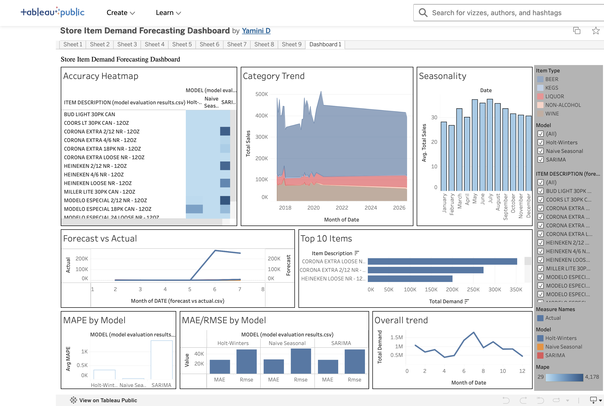

# Store Item Demand Forecasting

End-to-end demand forecasting project: raw, messy real-world retail data → cleaned time series → statistical forecasting models → interactive Tableau dashboard.

## Dashboard Preview
[](https://public.tableau.com/app/profile/yamini.d3675/viz/StoreItemDemandForecastingDashboard/Dashboard1)

🔗 **[Click here to explore the interactive dashboard](https://public.tableau.com/app/profile/yamini.d3675/viz/StoreItemDemandForecastingDashboard/Dashboard1)**

## Business Problem

Retailers need to forecast item-level demand to plan inventory, avoid stockouts, and reduce overstock costs. This project builds and evaluates statistical forecasting models on real transactional data to predict future item-level demand and presents the results in a business-facing dashboard.

## Dataset

**Source:** [Montgomery County, MD — Warehouse and Retail Sales](https://data.montgomerycountymd.gov/d/v76h-r7br) (public government data, updated monthly)

Real monthly sales and inventory movement data for every alcohol beverage item sold through Montgomery County's warehouse and retail stores.

- 329,394 transaction-level rows after cleaning
- 40,769 unique items across 5 categories (Beer, Wine, Liquor, Kegs, Non-Alcohol)
- June 2017 – July 2026 (9+ years, still updated monthly)

### Data Quality Issues Found & Handled
- Numeric columns stored as text with thousand-separator commas (`"1,199.43"`)
- Accounting-style negative values in parentheses (`(0.08)` = -0.08), representing returns
- Missing supplier names, item types, and sparse NaNs across sales columns
- Inconsistent text casing across supplier/item fields
- Highly intermittent demand — many items have long stretches of zero sales in a given month, which breaks naive percentage-error metrics (see Limitations)

## Tech Stack

- **Python** — pandas, NumPy, statsmodels, scikit-learn, matplotlib
- **Statistical Models** — Naive Seasonal (baseline), Holt-Winters Exponential Smoothing, SARIMA
- **Tableau Public** — interactive dashboard (web authoring, no desktop install)

## Workflow

1. **Inspection** — profiled raw CSV (`Warehouse_and_Retail_Sales.csv`): dtypes, missing values, duplicates, category structure
2. **Cleaning** — parsed messy numeric strings, standardized text fields, built proper date index, removed junk category rows
3. **Aggregation** — rolled transactions up to item-level monthly demand (`Retail Sales + Warehouse Sales`) → `item_monthly_demand.csv`
4. **EDA** — overall trend, category mix, monthly seasonality, top-selling items, zero-demand frequency (see `eda_*.png`)
5. **Feature Engineering** — lag features (1/2/3/12 month), rolling mean/std
6. **Modeling** — trained Naive Seasonal, Holt-Winters, and SARIMA per top-15 item, with a 6-month holdout test period
7. **Evaluation** — MAE, RMSE, MAPE per item and per model → `model_evaluation_results.csv`
8. **Export** — forecasts exported to `forecast_vs_actual.csv`, category summary to `category_monthly_summary.csv`
9. **Dashboard** — 4-page Tableau dashboard: Overview, Forecast vs Actual, Model Performance, Category Deep Dive

## Key Findings

- **Beer dominates category volume** at ~$7.67M in total sales — more than 3x Wine ($2.02M) and 7.6x Liquor ($1.0M) combined over the full period.
- Top-selling items are all core beer SKUs (Corona Extra, Heineken, Miller Lite loose/case formats) — a small number of items account for a disproportionate share of total demand, a classic 80/20 inventory pattern.
- On average error (MAE/RMSE), **Holt-Winters slightly outperformed SARIMA and the naive baseline** for the top-15 items over a 6-month holdout.
- **MAPE was unreliable and misleading here** — several top items have months with zero actual demand, which inflates percentage-error metrics dramatically. This is a real, common pitfall in intermittent-demand retail forecasting and a key reason MAE/RMSE were prioritized over MAPE when comparing models.
- Clear monthly seasonality exists in aggregate demand, supporting the use of seasonal models (Holt-Winters, SARIMA) over simpler trend-only approaches.

## Files in this Repo

| File | Description |
|---|---|
| `store_item_demand_forecasting.ipynb` | Full pipeline: cleaning → EDA → modeling → evaluation |
| `Warehouse_and_Retail_Sales.csv` | Raw source data *(gitignored — see below)* |
| `cleaned_warehouse_retail_sales.csv` | Cleaned transaction-level data *(gitignored — see below)* |
| `item_monthly_demand.csv` | Item-level monthly demand series |
| `category_monthly_summary.csv` | Category-level monthly totals |
| `forecast_vs_actual.csv` | Model forecasts vs actuals per item |
| `model_evaluation_results.csv` | MAE/RMSE/MAPE per item per model |
| `eda_overall_trend.png`, `eda_category_trend.png`, `eda_seasonality.png`, `eda_top_items.png`, `forecast_vs_actual_sample.png` | EDA and forecast visuals from the notebook |

> **Note:** `Warehouse_and_Retail_Sales.csv` and `cleaned_warehouse_retail_sales.csv` are excluded from version control (see `.gitignore`) to keep the repo lightweight. Download the raw file from [Montgomery County's open data portal](https://data.montgomerycountymd.gov/api/v3/views/v76h-r7br/export.csv?accessType=DOWNLOAD) and place it in this folder to re-run the notebook end to end.

## How to Run

```bash
git clone https://github.com/Yamini1727/store-item-demand-forecasting.git
cd store-item-demand-forecasting
pip install -r requirements.txt
jupyter notebook store_item_demand_forecasting.ipynb
```

## Limitations & Future Work

- Monthly granularity limits forecast precision compared to daily-level data.
- MAPE is unstable for intermittent-demand items; a scaled error metric (e.g., MASE) would be a better fit for future iterations.
- Currently models the top-15 items only; scaling to all 40K+ items would require a more automated per-item pipeline (e.g., looped SARIMA with auto-order selection via `pmdarima`, or a global ML model like LightGBM with item embeddings).
- Could incorporate external regressors (holidays, promotions) if such data becomes available.

## Author

Built as a portfolio project demonstrating statistical forecasting, data cleaning, and tableau dashboarding on real-world retail data.
